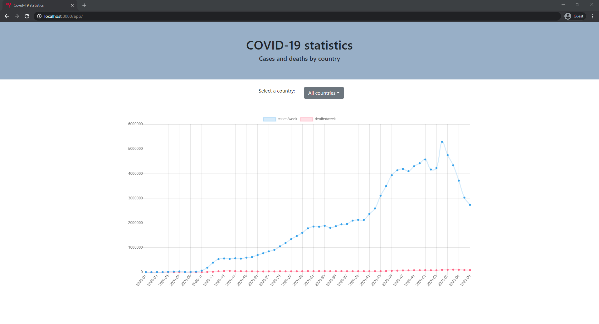
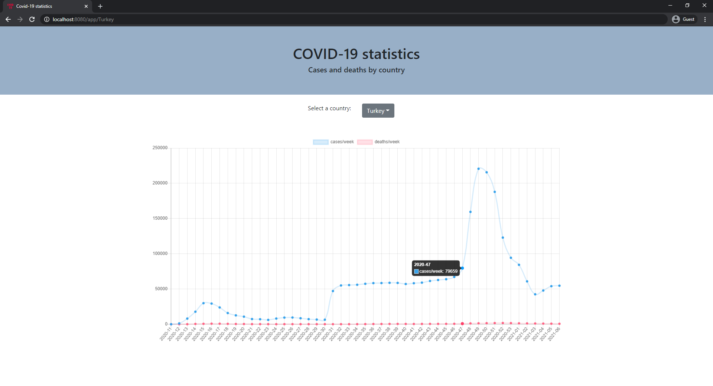

# Covid-19 statistics

## Examples
* All countries

* One country

* Information on hover


## Tools

* Backend - [Spring Boot](https://spring.io/projects/spring-boot)
* [JDK 11](https://www.oracle.com/java/technologies/javase-jdk11-downloads.html)
* Frontend - [React](https://reactjs.org/)
* Database - [H2](https://www.h2database.com/html/main.html) SQL database
* Additional: [Swagger](https://swagger.io/), [Maven](https://maven.apache.org/)

## Project structure
Project is based on layered architecture pattern. 
* Controller - API endpoints
* Repository - Data access layer.
* Service - Bussines logic layer.
* Domain - DATA layer.

## Embedded Tomcat
To run app from war file
```
mvn clean install org.codehaus.cargo:cargo-maven2-plugin:1.7.7:run -Dcargo.maven.containerId=tomcat9x -Dcargo.servlet.port=8080 -Dcargo.maven.containerUrl=https://repo1.maven.org/maven2/org/apache/tomcat/tomcat/9.0.40/tomcat-9.0.40.zip

```
Or run `mvn clean install` and make a new war file (app.war) in target folder and deploy it to Tomcat server.
### Application
```http://localhost:8080/app```
### Swagger
```http://localhost:8080/app/swagger-ui/```
### H2
```http://localhost:8080/app/console```
```
datasource url: jdbc:h2:mem:app
username: sa
password:
```

## Copyright
&copy;LauraStasiule